# ZwierzakSzukaDomu

Welcome to "ZwierzakSzukaDomu" - a dedicated platform for pet adoption. This service focuses on providing a comprehensive list of pet adoption announcements. Here, you'll find a variety of animals, each with its own unique story, eagerly waiting to find new, loving homes. We believe that every animal deserves a chance for a happy life, and we're confident that you'll find a lifelong friend here.

# Table of Contents

1. [Features](#features)
2. [Technology Stack](#technology-stack)
3. [Database Design and Structure](#database-design-and-structure)
4. [Design Patterns](#design-patterns)
5. [Installation](#installation)
6. [Demo](#demo)
7. [Usage](#usage)
8. [Contributing](#contributing)
9. [License](#license)

## Features

- **Browse Announcements:** Explore a wide range of pet adoption listings.
- **Detailed Pet Profiles:** Each pet comes with a detailed profile including its background, personality traits, and needs.
- **Advanced Search:** Filter searches based on animal type, features, and location to find your perfect match.
- **User Accounts:** Create your account to post adoption announcements or to interact with existing listings.
- **Responsive Design:** Platform is fully responsive, making it easy to navigate on various devices.

## Technology Stack

Project is built using a variety of technologies and tools to ensure efficiency, performance, and scalability. Below is a list of the key components:

1. **Front-End:**
   - HTML, CSS, JavaScript: For structuring, styling, and client-side logic.

2. **Back-End:**
   - PHP: Primary server-side programming language.
   - PostgreSQL: Robust and scalable database management system.

3. **Server:**
   - Nginx: High-performance web server.

4. **Containerization:**
   - Docker: For creating, deploying, and running applications in containers.
   - Docker Compose: For defining and running multi-container Docker applications.

5. **Version Control:**
   - Git: For source code management.
   - GitHub: For hosting the repository and facilitating version control and collaboration.

## Database Design and Structure

The project includes a comprehensive design and structure for the database, ensuring efficient data storage and retrieval. Here are the key components:

1. **Entity-Relationship Diagram (ERD):**
   - The `erd.png` file in the main directory provides a visual representation of the database schema. This diagram is useful for understanding the relationships between different entities in the database.
   - [View ERD](./erd.png)

2. **Database Schema:**
   - The `script.sql` file contains the SQL commands to create the database structure. It defines tables, relationships, and other database elements.
   - [View Database Script](./script.sql)

## Design patterns

1. **MVC (Model-View-Controller)**
   - Separates the application into Model, View, and Controller components.
   - **Example**: [models/Announcement.php](./src/models/announcement/Announcement.php), [views/announcement.php](./public/views/announcement.php), [controllers/AnnouncementController.php](./src/controllers/AnnouncementController.php)
2. **Repository**
   - Abstracts the data layer, providing a modular structure.
   - **Example**: [AnnouncementsRepository.php](./src/repository/AnnouncementsRepository.php)
3. **Strategy**
   - Allows different validation algorithms to be interchanged.
   - **Example**: [ValidationStrategy.php](./src/validation/ValidationStrategy.php)
4. **Observer**
   - Used for handling events.
   - **Example**: [debounce-search-controller.js](./public/js/controllers/debounce-search-controller.js#L12)
5. **State**
   - Allows an object to alter its behavior when its internal state changes.
   - **Example**: [filter-select.js](./public/js/controllers/filter-select.js)
6. **Template Method**
   - Defines the skeleton of an algorithm in a method, deferring some steps to subclasses.
   - **Example**: [form-controller.js](./public/js/controllers/form-controller.js#L128)
7. **Lazy initialization**
   - Delays the creation of an object until the first time it is needed.
   - **Example**: [AppController.php](./src/controllers/AppController.php#L24)
   

## Installation

Project is dockerized for easy setup and deployment. Follow these steps to get the project up and running:

1. **Clone the Repository**
2. **Navigate to the Project Directory**
3. **Docker Setup:**
Ensure Docker and Docker Compose are installed on your system. In the project directory, you'll find Docker configuration files in the `docker/db`, `docker/nginx`, and `docker/php` directories, along with a `Dockerfile` in each.
4. **Build Docker Images:**
`docker-compose build`
5. **Start Docker Containers:**
`docker-compose up`
6. **Access the Application:**
After the containers are up and running, you can access the application through your web browser.

## Demo
A live demo of "ZwierzakSzukaDomu" is available [here](https://wdpai.emef.dev/). The demo is publicly accessible and will be available until the end of 2024.

## Usage
### Home Page
The home page showcases the latest announcements and provides links to key functionalities of the site such as browsing all announcements, logging in, registering.
Desktop | Mobile
:-------------------------:|:-------------------------:
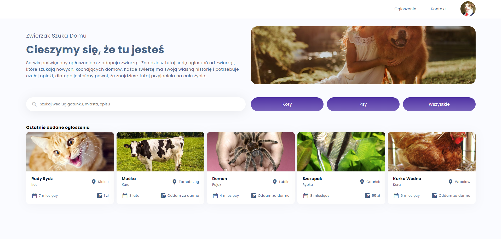  |  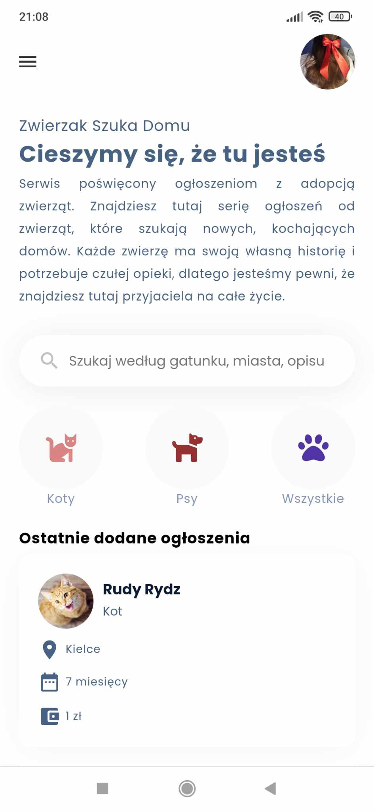

### All Announcements View
This page allows users to browse all available pets for adoption, with filtering options to help find the perfect pet.
Desktop | Mobile
:-------------------------:|:-------------------------:
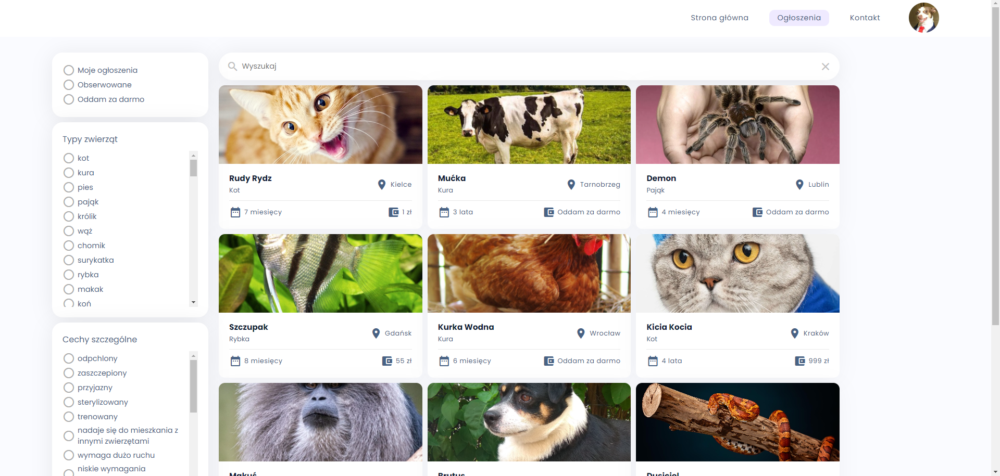 | 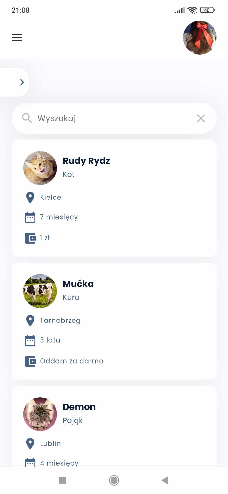

### Announcement View
This detailed view allows users to see full information about the pet, including photos, descriptions, location, and contact details of the person who posted the announcement.
Desktop | Mobile
:-------------------------:|:-------------------------:
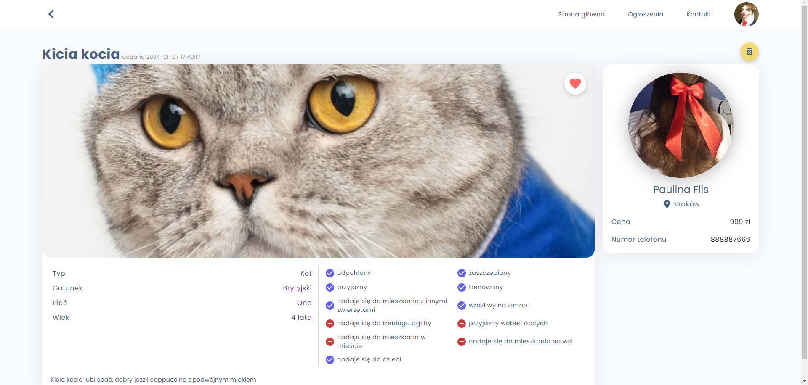 | 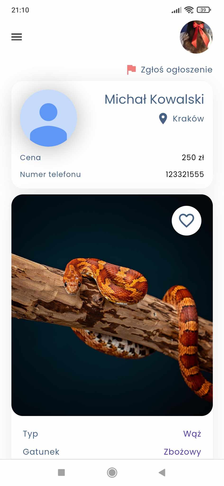

### Login and Registration View
These pages allow users to create and manage their accounts, which is necessary for posting announcements and using features that require authorization.
Desktop | Mobile
:-------------------------:|:-------------------------:
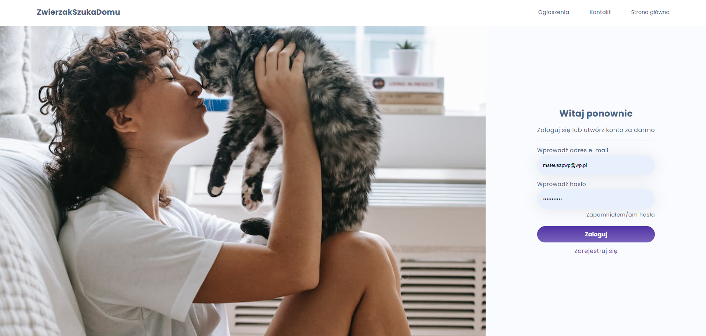 | 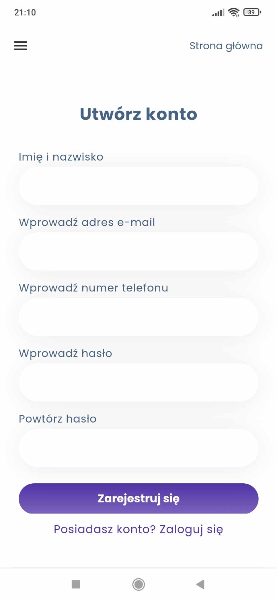

### Profile View
The profile view lets users manage their personal information, password and avatar.
Desktop | Mobile
:-------------------------:|:-------------------------:
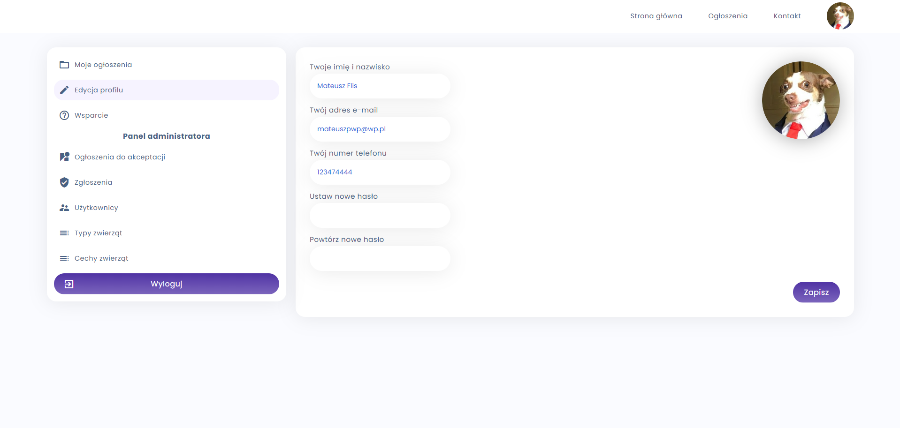 | 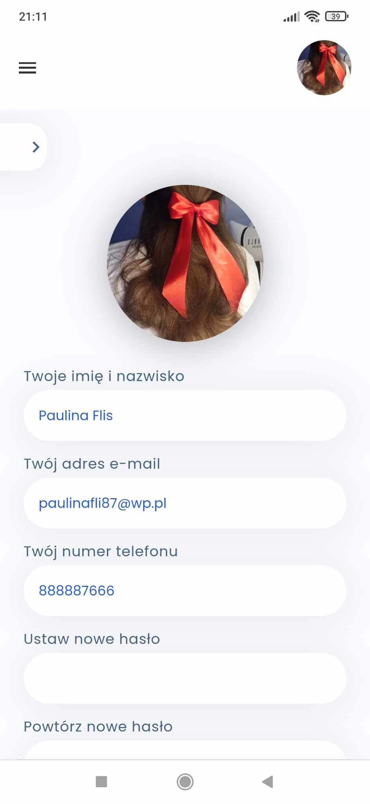

### My Announcements View
Here, users can view their own announcements.
Desktop | Mobile
:-------------------------:|:-------------------------:
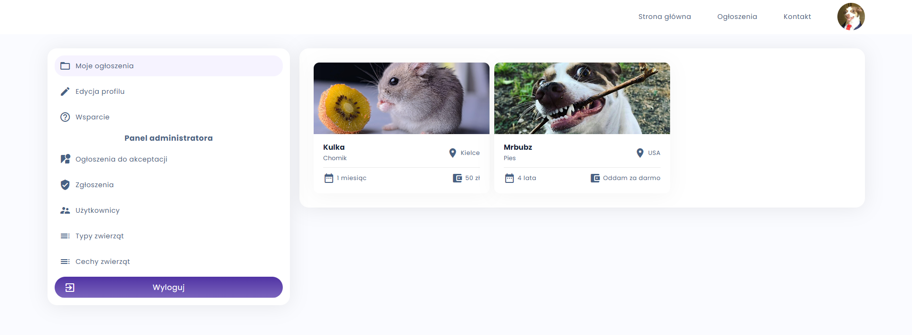 | 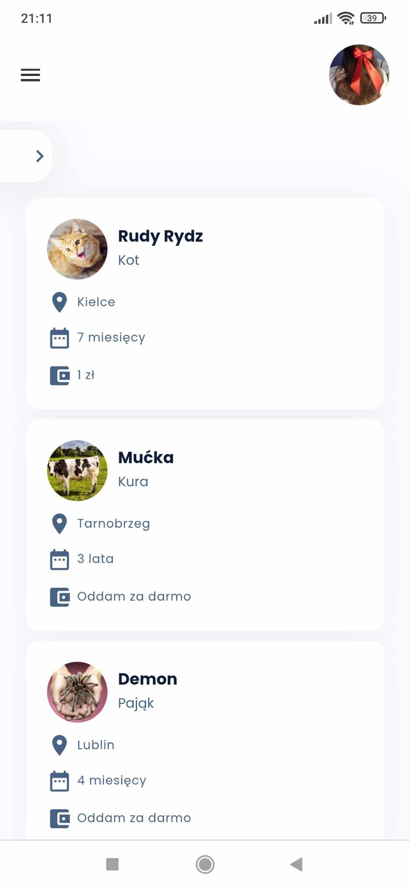

### Announcements for Admin Approval View
Available only to administrators, this view allows the review, approval, or rejection of new announcements before they are published.
Desktop | Mobile
:-------------------------:|:-------------------------:
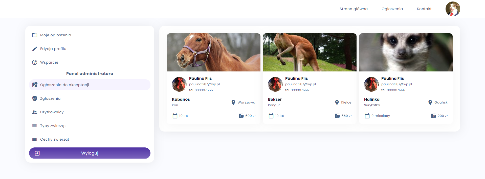 | 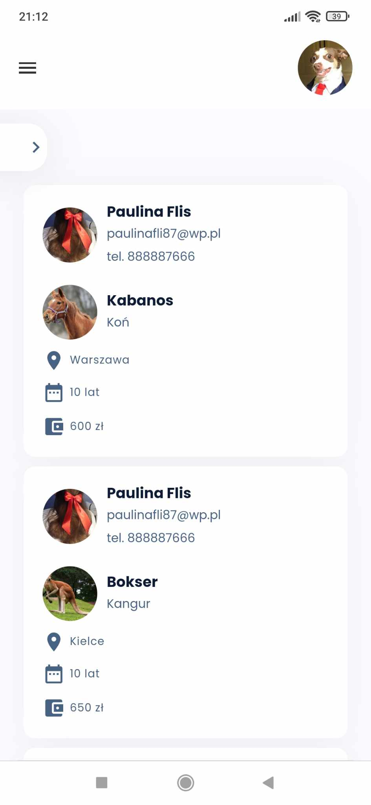

### Reports View
Also available only to administrators, this section allows for the review and management of user reports, such as violations of the rules.
Desktop | Mobile
:-------------------------:|:-------------------------:
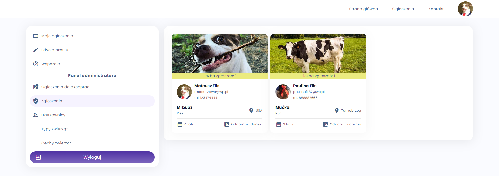 | 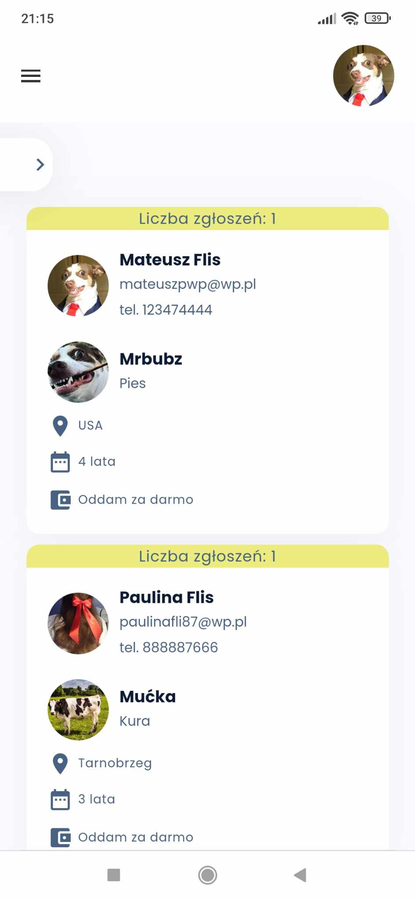

## Contributing
I am always looking to improve "ZwierzakSzukaDomu" and appreciate any feedback or contributions. If you would like to contribute, please feel free to fork the repository and submit a pull request.

## License

This project is licensed under the MIT License

